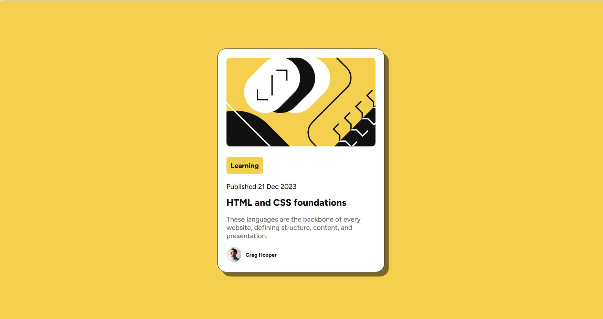

# Frontend Mentor - Blog preview card solution

This is a solution to the [Blog preview card challenge on Frontend Mentor](https://www.frontendmentor.io/challenges/blog-preview-card-ckPaj01IcS). Frontend Mentor challenges help you improve your coding skills by building realistic projects.

## Table of contents

  - [The challenge](#the-challenge)
  - [Screenshot](#screenshot)
  - [Links](#links)
- [My process](#my-process)
  - [Built with](#built-with)
  - [What I learned](#what-i-learned)
  - [Continued development](#continued-development)
  - [Useful resources](#useful-resources)
- [Author](#author)
- [Acknowledgments](#acknowledgments)

### The challenge

Users should be able to:

- See hover and focus states for all interactive elements on the page

### Screenshot

### Links

- Solution URL: [(https://github.com/monicaivanov/Blog-preview-card.git)]
- Live Site URL: [https://monicaivanov.github.io/Blog-preview-card/]

## My process
I tried to follow Frontend Mentor recomandations. 

### Built with

- Semantic HTML5 markup
- CSS custom properties
- Flexbox
- CSS Grid
- Mobile-first workflow

### What I learned

I practiced more grid, flexbox and HTML semantics. Still struggling with responsive design as I tend to design "pixel perfect".

### Continued development

As I learn to develop practical projects I better understand CSS rules and things start to make more sense. This is motivating me to keep going. I want to continue doing these challenges and get exposed to different situations with increased complexity. 

### Useful resources

- [CSS tricks](https://css-tricks.com/centering-css-complete-guide/) - I always come back to this article when I struggle to center horrizontally or vertically.

- [Frontend Mentor Articles](https://www.frontendmentor.io/articles/a-practical-guide-to-responsive-web-design-3mFeo4HklJ) - This is an amazing article (+video) which helped me understand responsive design beyond media query.  

## Author
- Frontend Mentor - [@monicaivanov](https://www.frontendmentor.io/profile/monicaivanov)

## Acknowledgments

Again I must acknowledge myself for finishing my 2nd project, being patient, putting the work and having fun with the chanllenge.